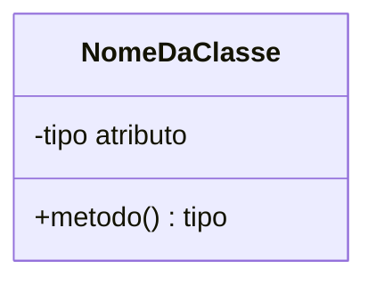
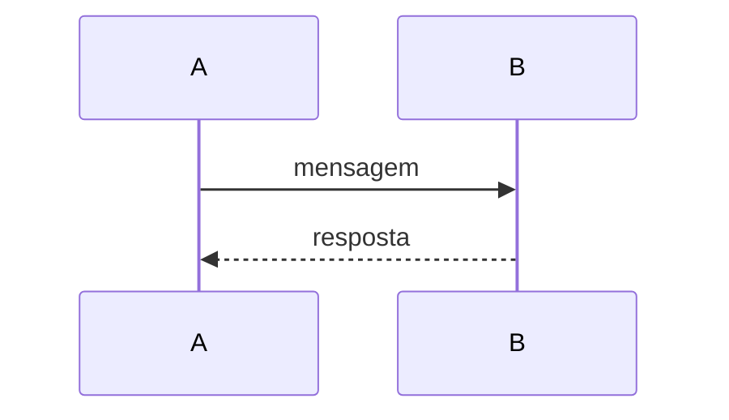
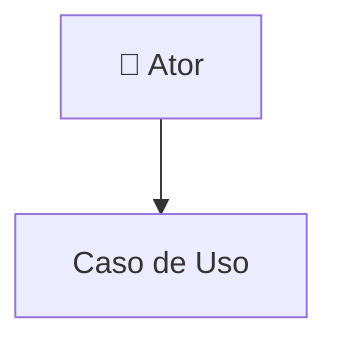
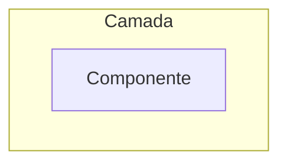

# 📚 Documentação do Projeto - Proteus ERP

## 📋 Índice de Documentos

### 1. 📊 [Diagrama de Classes](diagrama-classes.md)
Visualização completa das classes do sistema (Models, Controllers, componentes do framework) e seus relacionamentos.

**Conteúdo**:
- Estrutura das classes
- Atributos e métodos
- Relacionamentos (herança, composição, associação)
- Componentes do Leaf PHP Framework

---

### 2. 🔄 [Diagramas de Sequência](diagrama-sequencia.md)
Fluxo de execução detalhado das principais operações do sistema.

**Diagramas Incluídos**:
- Criar Cliente (com IA)
- Criar Pedido com Itens
- Editar Pedido
- Deletar Cliente
- Gerar Observação com IA (Gemini)
- Dashboard (Carregamento Inicial)

---

### 3. 🎯 [Diagrama de Casos de Uso](diagrama-casos-uso.md)
Funcionalidades do sistema do ponto de vista do usuário.

**Conteúdo**:
- Gerenciamento de Clientes (5 casos de uso)
- Gerenciamento de Produtos (5 casos de uso)
- Gerenciamento de Pedidos (7 casos de uso)
- Visualização e Relatórios (3 casos de uso)
- Descrição detalhada de cada caso de uso
- Matriz de relacionamentos

---

### 4. 🏗️ [Diagrama de Arquitetura](diagrama-arquitetura.md)
Visão técnica da arquitetura do sistema.

**Conteúdo**:
- Visão geral da arquitetura
- Arquitetura em camadas (Layered Architecture)
- Arquitetura MVC detalhada
- Fluxo de dados
- Estrutura de diretórios
- Componentes e tecnologias
- Padrões arquiteturais utilizados
- Segurança, performance e escalabilidade

---

### 5. 🗄️ [Estrutura do Banco de Dados](estrutura-banco-dados.md)
Documentação detalhada do banco de dados SQLite.

**Conteúdo**:
- Diagrama ER (Entidade-Relacionamento)
- Estrutura completa das 4 tabelas
- Relacionamentos e cardinalidades
- Scripts SQL de criação
- Índices e otimizações
- Dados de exemplo
- Queries comuns e relatórios
- Migrações e versionamento
- Backup e restore

---

### 6. [Documentação Completa](DOCUMENTACAO_COMPLETA.md)
Documentação técnica completa do projeto (200+ páginas).

**Seções**:
1. Visão Geral
2. Arquitetura do Sistema
3. Tecnologias Utilizadas
4. Estrutura do Projeto
5. Funcionalidades Detalhadas
6. Modelos de Dados
7. Controllers e Rotas
8. Views e Interface
9. Integração com IA
10. Banco de Dados
11. Instalação e Configuração
12. Guia de Uso
13. API Reference
14. Tratamento de Erros
15. Segurança
16. Performance e Otimização
17. Manutenção
18. Troubleshooting

---

## 🔍 Como Visualizar os Diagramas

### Opção 1: Visualizador Mermaid Online

1. Copie o código Mermaid de qualquer diagrama
2. Acesse: https://mermaid.live/
3. Cole o código no editor
4. Visualize e exporte como PNG/SVG

### Opção 2: Extensão VS Code/Cursor

1. Instale a extensão **"Markdown Preview Mermaid Support"**
2. Abra o arquivo `.md`
3. Pressione `Ctrl+Shift+V` (Preview)
4. Os diagramas serão renderizados automaticamente

### Opção 3: GitHub/GitLab

- Os arquivos `.md` com diagramas Mermaid são renderizados automaticamente no GitHub e GitLab

### Opção 4: Converter para PDF

#### Usando Pandoc:
```bash
pandoc DOCUMENTACAO_COMPLETA.md -o DOCUMENTACAO_COMPLETA.pdf --pdf-engine=xelatex
```

#### Usando Markdown to PDF (VS Code):
1. Instale extensão "Markdown PDF"
2. Abra arquivo `.md`
3. `Ctrl+Shift+P` → "Markdown PDF: Export (pdf)"

### Opção 5: Converter para Word

```bash
pandoc DOCUMENTACAO_COMPLETA.md -o DOCUMENTACAO_COMPLETA.docx
```

---

## 📊 Estrutura dos Diagramas

### Diagrama de Classes (Mermaid)


### Diagrama de Sequência (Mermaid)


### Diagrama de Casos de Uso (Mermaid Graph)


### Diagrama de Arquitetura (Mermaid Graph)


---

## 🛠️ Ferramentas Recomendadas

### Para Desenvolvedores

| Ferramenta | Propósito |
|------------|-----------|
| **VS Code / Cursor** | Editor de código |
| **Markdown Preview** | Visualizar documentação |
| **Mermaid Extension** | Renderizar diagramas |
| **Draw.io** | Editar diagramas manualmente |

### Para Análise de Requisitos

| Ferramenta | Propósito |
|------------|-----------|
| **Mermaid Live Editor** | Editar diagramas online |
| **StarUML** | UML profissional |
| **Lucidchart** | Diagramas colaborativos |

### Para Exportar Documentação

| Ferramenta | Propósito |
|------------|-----------|
| **Pandoc** | Converter Markdown → PDF/Word |
| **Markdown PDF** | Extensão VS Code |
| **Typora** | Editor Markdown com exportação |

---

## 📦 Exportar Documentação Completa

### Gerar PDF único com todos os documentos

```bash
# Concatenar todos os arquivos
cat \
    diagrama-classes.md \
    diagrama-sequencia.md \
    diagrama-casos-uso.md \
    diagrama-arquitetura.md \
    DOCUMENTACAO_COMPLETA.md \
    > DOCUMENTACAO_COMPLETA_UNIFICADA.md

# Converter para PDF
pandoc DOCUMENTACAO_COMPLETA_UNIFICADA.md -o Proteus_ERP_Documentacao.pdf \
    --pdf-engine=xelatex \
    --toc \
    --toc-depth=3 \
    --number-sections \
    -V geometry:margin=2cm
```

### Gerar Word

```bash
pandoc DOCUMENTACAO_COMPLETA.md -o Proteus_ERP_Documentacao.docx \
    --toc \
    --toc-depth=3 \
    --number-sections \
    --reference-doc=template.docx
```

---

## 🎯 Guia Rápido de Uso da Documentação

### Para Desenvolvedores Iniciando no Projeto
1. Leia [DOCUMENTACAO_COMPLETA.md](DOCUMENTACAO_COMPLETA.md) seções 1-4
2. Estude [Diagrama de Arquitetura](diagrama-arquitetura.md)
3. Revise [Diagrama de Classes](diagrama-classes.md)
4. Siga [Instalação e Configuração](DOCUMENTACAO_COMPLETA.md#11-instalação-e-configuração)

### Para Análise de Requisitos
1. Estude [Diagrama de Casos de Uso](diagrama-casos-uso.md)
2. Revise [Funcionalidades Detalhadas](DOCUMENTACAO_COMPLETA.md#5-funcionalidades-detalhadas)
3. Analise [Diagramas de Sequência](diagrama-sequencia.md)

### Para Manutenção
1. Consulte [Troubleshooting](DOCUMENTACAO_COMPLETA.md#18-troubleshooting)
2. Revise [Manutenção](DOCUMENTACAO_COMPLETA.md#17-manutenção)
3. Entenda [Modelos de Dados](DOCUMENTACAO_COMPLETA.md#6-modelos-de-dados)

### Para Apresentação/Defesa
1. Use slides com diagramas visuais
2. Demonstre fluxos com [Diagramas de Sequência](diagrama-sequencia.md)
3. Explique arquitetura com [Diagrama de Arquitetura](diagrama-arquitetura.md)

---

## 📝 Convenções da Documentação

### Formatação de Código

**PHP**:
```php
public function metodo() {
    // código
}
```

**SQL**:
```sql
SELECT * FROM tabela WHERE id = 1;
```

**JavaScript**:
```javascript
function exemplo() {
    console.log('Hello');
}
```

**Bash**:
```bash
composer install
```

### Emojis Utilizados

| Emoji | Significado |
|-------|-------------|
| 📘 | Documentação principal |
| 📋 | Índice/Lista |
| 🔍 | Visualização/Pesquisa |
| 📊 | Diagramas |
| 🛠️ | Ferramentas |
| 📦 | Pacotes/Exportação |
| 🎯 | Guia/Objetivo |
| 📝 | Convenções/Notas |
| ✅ | Vantagem/Sucesso |
| ❌ | Desvantagem/Erro |
| 🚀 | Performance/Deploy |
| 🔒 | Segurança |
| 👤 | Usuário/Ator |
| 🤖 | IA/Automação |
| 🌐 | Web/Navegador |

---

## 🔄 Atualizações da Documentação

**Última Atualização**: Novembro 2024  
**Versão**: 1.0

### Histórico de Versões

| Versão | Data | Alterações |
|--------|------|------------|
| 1.0 | Nov 2024 | Documentação inicial completa |

### Como Contribuir

1. Identifique seção a atualizar
2. Edite arquivo `.md` correspondente
3. Mantenha formatação Markdown
4. Atualize data de modificação
5. Commit com mensagem descritiva

---

## 📧 Contato e Suporte

**Repositório**: [GitHub Link]  
**Documentação Online**: [Link se houver]  
**Issues**: [GitHub Issues Link]

---

**Desenvolvido com** ❤️ **pela Equipe Proteus ERP**

