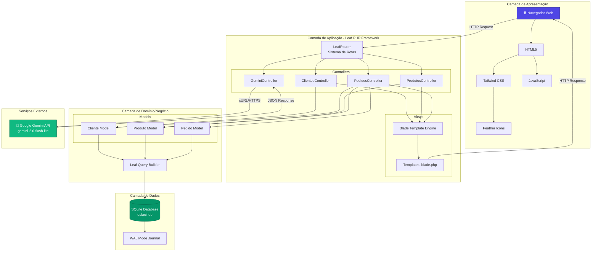
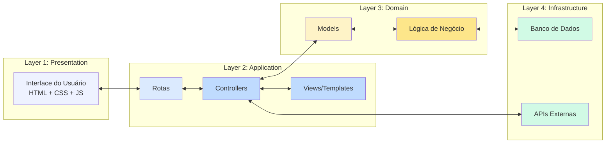
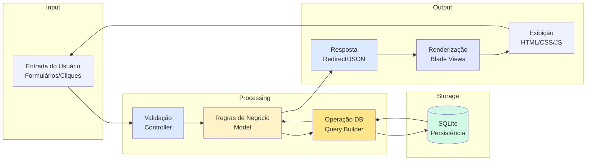

# Diagrama de Arquitetura - Proteus ERP

## 1. Visão Geral da Arquitetura



## 2. Arquitetura em Camadas (Layered Architecture)



## 3. Arquitetura MVC Detalhada

```mermaid
graph TB
    subgraph "CLIENT SIDE"
        User[👤 Usuário]
        Browser[Navegador]
    end

    subgraph "VIEW LAYER"
        Layout[index.blade.php<br/>Layout Master]
        Dashboard[dashboard.blade.php]
        ClienteViews[Cliente Views<br/>Cadastrar | Listar | Editar]
        ProdutoViews[Produto Views<br/>Cadastrar | Listar | Editar]
        PedidoViews[Pedido Views<br/>Cadastrar | Listar | Editar]
    end

    subgraph "CONTROLLER LAYER"
        Routes[_app.php<br/>Definições de Rotas]
        CC[ClientesController<br/>7 métodos]
        PC[ProdutosController<br/>7 métodos]
        PDC[PedidosController<br/>7 métodos]
        GC[GeminiController<br/>3 métodos]
    end

    subgraph "MODEL LAYER"
        CM[Cliente Model<br/>7 métodos + 7 atributos]
        PM[Produto Model<br/>7 métodos + 5 atributos]
        PDM[Pedido Model<br/>10 métodos + 5 atributos]
    end

    subgraph "DATA LAYER"
        SQLite[(SQLite DB<br/>osfacil.db)]
        Tables[Tabelas:<br/>- clientes<br/>- produtos<br/>- pedidos<br/>- pedido_itens]
    end

    subgraph "EXTERNAL"
        Gemini[Google Gemini API]
    end

    User --> Browser
    Browser -->|HTTP GET/POST| Routes
    
    Routes --> CC
    Routes --> PC
    Routes --> PDC
    Routes --> GC
    
    CC <-->|CRUD| CM
    PC <-->|CRUD| PM
    PDC <-->|CRUD| PDM
    PDC <--> CM
    PDC <--> PM
    
    CC -->|render| ClienteViews
    PC -->|render| ProdutoViews
    PDC -->|render| PedidoViews
    
    Layout --> Dashboard
    Layout --> ClienteViews
    Layout --> ProdutoViews
    Layout --> PedidoViews
    
    ClienteViews -->|HTML| Browser
    ProdutoViews -->|HTML| Browser
    PedidoViews -->|HTML| Browser
    
    CM --> SQLite
    PM --> SQLite
    PDM --> SQLite
    SQLite --> Tables
    
    GC -->|API Call| Gemini
    Gemini -->|JSON| GC
    GC -->|JSON| Browser

    style User fill:#4F46E5,color:#fff
    style SQLite fill:#059669,color:#fff
    style Gemini fill:#10B981,color:#fff
```

## 4. Fluxo de Dados (Data Flow)



## 5. Estrutura de Diretórios

```
lab-engsof-web-protheus-app/
│
├── app/
│   ├── controllers/           # Camada de Controle
│   │   ├── Controller.php     # Base Controller
│   │   ├── ClientesController.php
│   │   ├── ProdutosController.php
│   │   ├── PedidosController.php
│   │   └── GeminiController.php
│   │
│   ├── models/                # Camada de Domínio
│   │   ├── Model.php          # Base Model
│   │   ├── Cliente.php
│   │   ├── Produto.php
│   │   └── Pedido.php
│   │
│   ├── views/                 # Camada de Apresentação
│   │   ├── index.blade.php    # Layout Master
│   │   ├── dashboard.blade.php
│   │   ├── Cliente*.blade.php # Views de Cliente
│   │   ├── Produto*.blade.php # Views de Produto
│   │   └── Pedido*.blade.php  # Views de Pedido
│   │
│   ├── routes/                # Configuração de Rotas
│   │   └── _app.php
│   │
│   └── database/              # Configurações de DB
│
├── public/                    # Arquivos Públicos
│   ├── index.php              # Entry Point
│   ├── assets/
│   │   ├── css/
│   │   ├── js/
│   │   └── img/
│   └── favicon.ico
│
├── storage/                   # Armazenamento
│   ├── framework/
│   │   └── views/             # Cache de Views compiladas
│   └── logs/                  # Logs da aplicação
│
├── vendor/                    # Dependências (Composer)
│   ├── leafs/                 # Leaf PHP Framework
│   │   ├── leaf/
│   │   ├── db/
│   │   ├── blade/
│   │   └── mvc-core/
│   └── ...
│
├── docs/                      # Documentação do Projeto
│   ├── diagrama-classes.md
│   ├── diagrama-sequencia.md
│   ├── diagrama-casos-uso.md
│   └── diagrama-arquitetura.md
│
├── composer.json              # Dependências PHP
├── osfacil.db                 # Banco de Dados SQLite
├── .env                       # Variáveis de Ambiente
└── README.MD                  # Documentação Inicial
```

## 6. Componentes e Tecnologias

### Frontend
| Componente | Tecnologia | Versão | Função |
|------------|-----------|--------|---------|
| Estrutura | HTML5 | - | Marcação semântica |
| Estilização | Tailwind CSS | 3.x (CDN) | Framework CSS utilitário |
| Scripts | JavaScript Vanilla | ES6+ | Interatividade |
| Ícones | Feather Icons | Latest | Iconografia |
| Template | Blade | Leaf PHP | Engine de templates |

### Backend
| Componente | Tecnologia | Versão | Função |
|------------|-----------|--------|---------|
| Framework | Leaf PHP | 3.x | Framework MVC |
| Linguagem | PHP | 8.0+ | Linguagem servidor |
| Roteamento | LeafRouter | Built-in | Gerenciamento de rotas |
| Database | Leaf DB | Built-in | ORM/Query Builder |
| HTTP | Leaf HTTP | Built-in | Request/Response |

### Banco de Dados
| Componente | Tecnologia | Configuração |
|------------|-----------|--------------|
| SGBD | SQLite | 3.x |
| Journal Mode | WAL | Write-Ahead Logging |
| Busy Timeout | 5000ms | Aguardar lock |
| Arquivo | osfacil.db | Único arquivo |

### Integrações Externas
| Serviço | API | Modelo | Função |
|---------|-----|--------|---------|
| Google Gemini | REST API | gemini-2.0-flash-lite | Geração de conteúdo com IA |

## 7. Padrões Arquiteturais Utilizados

### 1. MVC (Model-View-Controller)
- **Separação de Responsabilidades**: Cada camada tem função específica
- **Models**: Lógica de negócio e acesso a dados
- **Views**: Apresentação (Blade templates)
- **Controllers**: Coordenação entre Models e Views

### 2. Repository Pattern
- Models atuam como repositórios
- Encapsulam acesso ao banco de dados
- Métodos CRUD padronizados

### 3. Query Builder Pattern
- LeafDB fornece interface fluente
- Abstração de SQL nativo
- Segurança contra SQL Injection

### 4. Template Method Pattern
- Base classes (Model, Controller)
- Subclasses implementam métodos específicos

### 5. RESTful Architecture
- Rotas seguem convenções REST
- GET para consultas
- POST para modificações

## 8. Segurança

### Medidas Implementadas
1. **Validação de Entrada**: Controllers validam dados antes de processar
2. **Query Builder**: Previne SQL Injection
3. **CSRF Protection**: Tokens em formulários (Leaf Framework)
4. **Environment Variables**: Chaves sensíveis em `.env`
5. **Error Handling**: Try-catch em operações críticas

### Melhorias Recomendadas
1. **Autenticação**: Sistema de login
2. **Autorização**: Controle de acesso por perfil
3. **HTTPS**: Comunicação criptografada
4. **Rate Limiting**: Limitar chamadas à API
5. **Input Sanitization**: Sanitização adicional

## 9. Performance

### Otimizações Aplicadas
1. **SQLite WAL Mode**: Leituras e escritas simultâneas
2. **Busy Timeout**: Evita falhas por lock
3. **Template Caching**: Blade compila templates
4. **CDN**: Tailwind e Feather via CDN
5. **Lazy Loading**: Modelos carregados sob demanda

### Métricas Esperadas
- **Tempo de Resposta**: < 100ms (operações simples)
- **Tamanho Página**: ~50KB (média)
- **Requests**: 1-3 por página
- **Database Queries**: 1-5 por request

## 10. Escalabilidade

### Limitações Atuais (SQLite)
- Escritas sequenciais (mitigado por WAL)
- Conexões limitadas
- Tamanho máximo ~281TB (mais que suficiente)

### Migração Futura (se necessário)
1. **MySQL/PostgreSQL**: Para alta concorrência
2. **API REST**: Separar frontend/backend
3. **Microserviços**: Dividir domínios
4. **Cache**: Redis para sessões
5. **Load Balancer**: Distribuir carga

## 11. Deployment

### Ambiente Desenvolvimento
```
PHP Built-in Server
├── Host: localhost
├── Port: 5500
└── Command: php -S localhost:5500 -t public
```

### Ambiente Produção (Recomendado)
```
Apache/Nginx + PHP-FPM
├── Web Server: Apache 2.4+ ou Nginx
├── PHP: 8.0+ com extensões (pdo_sqlite, curl, mbstring)
├── Database: osfacil.db com permissões adequadas
└── SSL: Certificado HTTPS
```

## 12. Monitoramento

### Logs
- **Localização**: `storage/logs/app.log`
- **Formato**: PSR-3 (Leaf Logger)
- **Níveis**: Error, Warning, Info, Debug

### Métricas Sugeridas
1. Tempo de resposta por rota
2. Erros HTTP (4xx, 5xx)
3. Uso de disco (SQLite)
4. Chamadas à API Gemini

