# Diagrama de Casos de Uso - Proteus ERP

```mermaid
graph TB
    %% Atores
    Usuario[👤 Usuário do Sistema]
    IA[🤖 Google Gemini API]

    %% Casos de Uso - Clientes
    subgraph "Gerenciamento de Clientes"
        UC1[Cadastrar Cliente]
        UC2[Listar Clientes]
        UC3[Editar Cliente]
        UC4[Excluir Cliente]
        UC5[Gerar Observação de Cliente com IA]
    end

    %% Casos de Uso - Produtos
    subgraph "Gerenciamento de Produtos"
        UC6[Cadastrar Produto]
        UC7[Listar Produtos]
        UC8[Editar Produto]
        UC9[Excluir Produto]
        UC10[Gerar Descrição de Produto com IA]
    end

    %% Casos de Uso - Pedidos
    subgraph "Gerenciamento de Pedidos"
        UC11[Criar Pedido]
        UC12[Listar Pedidos]
        UC13[Editar Pedido]
        UC14[Excluir Pedido]
        UC15[Adicionar Item ao Pedido]
        UC16[Remover Item do Pedido]
        UC17[Calcular Total do Pedido]
    end

    %% Casos de Uso - Dashboard
    subgraph "Visualização e Relatórios"
        UC18[Visualizar Dashboard]
        UC19[Consultar Estatísticas]
        UC20[Visualizar Faturamento Total]
    end

    %% Relacionamentos Usuario
    Usuario --> UC1
    Usuario --> UC2
    Usuario --> UC3
    Usuario --> UC4
    Usuario --> UC5
    
    Usuario --> UC6
    Usuario --> UC7
    Usuario --> UC8
    Usuario --> UC9
    Usuario --> UC10
    
    Usuario --> UC11
    Usuario --> UC12
    Usuario --> UC13
    Usuario --> UC14
    Usuario --> UC15
    Usuario --> UC16
    Usuario --> UC17
    
    Usuario --> UC18
    Usuario --> UC19
    Usuario --> UC20

    %% Relacionamentos IA
    UC5 --> IA
    UC10 --> IA

    %% Includes e Extends
    UC1 -.->|<<include>>| UC5
    UC6 -.->|<<include>>| UC10
    UC11 -.->|<<include>>| UC15
    UC11 -.->|<<include>>| UC17
    UC13 -.->|<<include>>| UC15
    UC13 -.->|<<include>>| UC16
    UC13 -.->|<<include>>| UC17
    UC18 -.->|<<include>>| UC19
    UC19 -.->|<<include>>| UC20

    style Usuario fill:#4F46E5,stroke:#312E81,color:#fff
    style IA fill:#10B981,stroke:#065F46,color:#fff
```

## Descrição Detalhada dos Casos de Uso

### 1. Gerenciamento de Clientes

#### UC1 - Cadastrar Cliente
**Descrição**: Permite ao usuário criar um novo registro de cliente no sistema.

**Pré-condições**: 
- Usuário acessa a página de cadastro de clientes

**Fluxo Principal**:
1. Usuário acessa "Cliente" > "Cadastrar"
2. Sistema exibe formulário de cadastro
3. Usuário preenche dados obrigatórios (Nome, CPF)
4. Usuário preenche dados opcionais (Telefone, Email, Endereço)
5. Usuário pode clicar em "Gerar com IA" para observações (UC5)
6. Usuário clica em "Salvar"
7. Sistema valida os dados
8. Sistema salva o cliente no banco de dados
9. Sistema redireciona para lista de clientes

**Pós-condições**: Cliente cadastrado no sistema

**Fluxos Alternativos**:
- **FA1**: Dados inválidos - Sistema exibe mensagem de erro
- **FA2**: CPF duplicado - Sistema alerta sobre duplicidade

---

#### UC2 - Listar Clientes
**Descrição**: Exibe todos os clientes cadastrados no sistema.

**Pré-condições**: Nenhuma

**Fluxo Principal**:
1. Usuário acessa "Cliente" > "Listar"
2. Sistema busca todos os clientes no banco
3. Sistema exibe tabela com: ID, Nome, CPF, Telefone, Email, Ações
4. Usuário pode clicar em "Editar" ou "Deletar"

**Pós-condições**: Lista de clientes exibida

---

#### UC3 - Editar Cliente
**Descrição**: Permite modificar os dados de um cliente existente.

**Pré-condições**: Cliente deve existir no sistema

**Fluxo Principal**:
1. Usuário clica em "Editar" na lista de clientes
2. Sistema busca dados do cliente pelo ID
3. Sistema exibe formulário preenchido
4. Usuário modifica dados desejados
5. Usuário clica em "Atualizar"
6. Sistema valida os dados
7. Sistema atualiza o registro no banco
8. Sistema redireciona para lista de clientes

**Pós-condições**: Dados do cliente atualizados

---

#### UC4 - Excluir Cliente
**Descrição**: Remove um cliente do sistema.

**Pré-condições**: 
- Cliente deve existir
- Cliente não pode ter pedidos vinculados (verificação futura)

**Fluxo Principal**:
1. Usuário clica em "Deletar" na lista
2. Sistema solicita confirmação
3. Usuário confirma exclusão
4. Sistema remove o cliente do banco
5. Sistema redireciona para lista atualizada

**Pós-condições**: Cliente removido do sistema

**Fluxos Alternativos**:
- **FA1**: Usuário cancela - Sistema mantém cliente

---

#### UC5 - Gerar Observação de Cliente com IA
**Descrição**: Usa IA para gerar observações automáticas sobre o cliente.

**Pré-condições**: 
- Formulário de cliente preenchido
- API Gemini configurada

**Fluxo Principal**:
1. Usuário preenche dados do cliente
2. Usuário clica em "Gerar com IA"
3. Sistema coleta dados preenchidos
4. Sistema envia prompt para Google Gemini API
5. IA processa e retorna observação profissional
6. Sistema preenche campo "Observações" automaticamente

**Pós-condições**: Campo observações preenchido

**Fluxos Alternativos**:
- **FA1**: Erro na API - Sistema exibe mensagem de erro
- **FA2**: Timeout - Sistema notifica usuário

---

### 2. Gerenciamento de Produtos

#### UC6 - Cadastrar Produto
**Descrição**: Permite criar um novo produto no catálogo.

**Pré-condições**: Usuário acessa página de cadastro

**Fluxo Principal**:
1. Usuário acessa "Produto" > "Cadastrar"
2. Sistema exibe formulário
3. Usuário preenche Nome, Preço
4. Usuário preenche Descrição e Estoque (opcionais)
5. Usuário pode usar IA para descrição (UC10)
6. Usuário clica em "Salvar"
7. Sistema valida dados
8. Sistema salva produto no banco
9. Sistema redireciona para lista de produtos

**Pós-condições**: Produto cadastrado

---

#### UC7 - Listar Produtos
**Descrição**: Exibe todos os produtos do catálogo.

**Fluxo Principal**:
1. Usuário acessa "Produto" > "Listar"
2. Sistema busca todos os produtos
3. Sistema exibe tabela com: ID, Nome, Descrição, Preço, Estoque, Ações

**Pós-condições**: Lista de produtos exibida

---

#### UC8 - Editar Produto
**Descrição**: Modifica dados de um produto existente.

**Fluxo Principal**:
1. Usuário clica em "Editar"
2. Sistema busca dados do produto
3. Sistema exibe formulário preenchido
4. Usuário modifica dados
5. Usuário salva alterações
6. Sistema atualiza banco de dados

**Pós-condições**: Produto atualizado

---

#### UC9 - Excluir Produto
**Descrição**: Remove um produto do catálogo.

**Fluxo Principal**:
1. Usuário clica em "Deletar"
2. Sistema solicita confirmação
3. Usuário confirma
4. Sistema remove produto

**Pós-condições**: Produto removido

---

#### UC10 - Gerar Descrição de Produto com IA
**Descrição**: Usa IA para gerar descrição técnica do produto.

**Fluxo Principal**:
1. Usuário preenche dados básicos do produto
2. Usuário clica em "Gerar com IA"
3. Sistema envia dados para Google Gemini API
4. IA gera descrição técnica profissional
5. Sistema preenche campo "Descrição"

**Pós-condições**: Descrição gerada automaticamente

---

### 3. Gerenciamento de Pedidos

#### UC11 - Criar Pedido
**Descrição**: Registra um novo pedido no sistema.

**Pré-condições**: 
- Pelo menos 1 cliente cadastrado
- Pelo menos 1 produto cadastrado

**Fluxo Principal**:
1. Usuário acessa "Pedido" > "Cadastrar"
2. Sistema exibe formulário com lista de clientes e produtos
3. Usuário seleciona cliente
4. Usuário adiciona produtos (UC15)
5. Sistema calcula total automaticamente (UC17)
6. Usuário define status
7. Usuário clica em "Salvar Pedido"
8. Sistema cria pedido e itens associados
9. Sistema redireciona para lista de pedidos

**Pós-condições**: Pedido criado com itens

---

#### UC12 - Listar Pedidos
**Descrição**: Exibe todos os pedidos registrados.

**Fluxo Principal**:
1. Usuário acessa "Pedido" > "Listar"
2. Sistema busca pedidos com dados do cliente
3. Sistema exibe: ID, Cliente, Data, Total, Status, Ações

**Pós-condições**: Lista de pedidos exibida

---

#### UC13 - Editar Pedido
**Descrição**: Modifica um pedido existente.

**Fluxo Principal**:
1. Usuário clica em "Editar"
2. Sistema busca pedido e seus itens
3. Sistema exibe formulário preenchido
4. Usuário modifica dados, adiciona/remove itens
5. Sistema recalcula total
6. Usuário salva alterações
7. Sistema atualiza pedido

**Pós-condições**: Pedido atualizado

---

#### UC14 - Excluir Pedido
**Descrição**: Remove um pedido do sistema.

**Fluxo Principal**:
1. Usuário clica em "Excluir"
2. Sistema solicita confirmação
3. Usuário confirma
4. Sistema remove itens do pedido
5. Sistema remove pedido

**Pós-condições**: Pedido e itens removidos

---

#### UC15 - Adicionar Item ao Pedido
**Descrição**: Adiciona um produto ao pedido.

**Fluxo Principal**:
1. Usuário clica em "Adicionar Produto"
2. Sistema cria nova linha na tabela
3. Usuário seleciona produto
4. Sistema preenche preço automaticamente
5. Usuário define quantidade
6. Sistema calcula subtotal

**Pós-condições**: Item adicionado ao pedido

---

#### UC16 - Remover Item do Pedido
**Descrição**: Remove um produto do pedido.

**Fluxo Principal**:
1. Usuário clica em ícone de exclusão no item
2. Sistema remove linha da tabela
3. Sistema recalcula total

**Pós-condições**: Item removido

---

#### UC17 - Calcular Total do Pedido
**Descrição**: Calcula automaticamente o valor total do pedido.

**Fluxo Principal**:
1. Sistema monitora alterações nos itens
2. Para cada item, calcula: preço × quantidade
3. Sistema soma todos os subtotais
4. Sistema exibe total formatado

**Pós-condições**: Total calculado e exibido

---

### 4. Visualização e Relatórios

#### UC18 - Visualizar Dashboard
**Descrição**: Exibe painel com resumo do sistema.

**Fluxo Principal**:
1. Usuário acessa página inicial (/)
2. Sistema busca estatísticas (UC19)
3. Sistema exibe 4 cards informativos

**Pós-condições**: Dashboard exibido

---

#### UC19 - Consultar Estatísticas
**Descrição**: Coleta dados estatísticos do sistema.

**Fluxo Principal**:
1. Sistema conta total de clientes
2. Sistema conta total de produtos
3. Sistema conta total de pedidos
4. Sistema calcula faturamento total (UC20)

**Pós-condições**: Estatísticas calculadas

---

#### UC20 - Visualizar Faturamento Total
**Descrição**: Calcula e exibe faturamento total dos pedidos.

**Fluxo Principal**:
1. Sistema soma campo "total" de todos os pedidos
2. Sistema formata valor em R$
3. Sistema exibe no card "Faturamento"

**Pós-condições**: Faturamento exibido

---

## Matriz de Relacionamentos

| Caso de Uso | Include | Extend | Ator Principal |
|-------------|---------|--------|----------------|
| UC1 - Cadastrar Cliente | UC5 | - | Usuário |
| UC5 - Gerar Observação IA | - | - | Google Gemini API |
| UC6 - Cadastrar Produto | UC10 | - | Usuário |
| UC10 - Gerar Descrição IA | - | - | Google Gemini API |
| UC11 - Criar Pedido | UC15, UC17 | - | Usuário |
| UC13 - Editar Pedido | UC15, UC16, UC17 | - | Usuário |
| UC18 - Visualizar Dashboard | UC19 | - | Usuário |
| UC19 - Consultar Estatísticas | UC20 | - | Sistema |

## Requisitos Funcionais Identificados

1. **RF001**: O sistema deve permitir CRUD completo de clientes
2. **RF002**: O sistema deve permitir CRUD completo de produtos
3. **RF003**: O sistema deve permitir CRUD completo de pedidos
4. **RF004**: O sistema deve permitir adicionar múltiplos produtos a um pedido
5. **RF005**: O sistema deve calcular automaticamente o total do pedido
6. **RF006**: O sistema deve integrar com Google Gemini API para geração de conteúdo
7. **RF007**: O sistema deve exibir dashboard com estatísticas
8. **RF008**: O sistema deve calcular faturamento total
9. **RF009**: O sistema deve validar dados antes de salvar
10. **RF010**: O sistema deve confirmar exclusões

