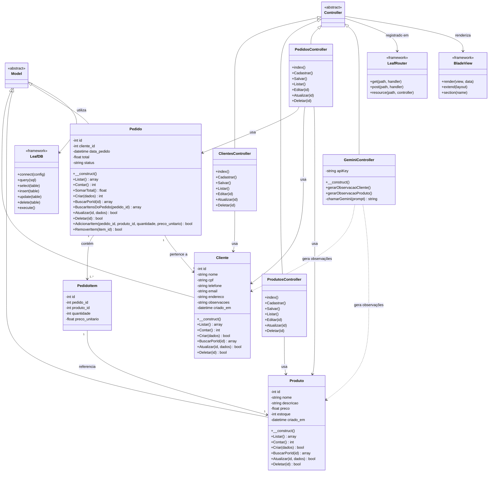

# Diagrama de Classes - Proteus ERP

## Descrição das Classes

### Models (Camada de Dados)

#### Model (Abstrato)
Classe base para todos os models, fornece funcionalidades comuns de acesso ao banco de dados.

#### Cliente
Gerencia os dados de clientes do sistema.
- **Atributos**: id, nome, cpf, telefone, email, endereco, observacoes, criado_em
- **Responsabilidades**: CRUD completo de clientes, contagem de registros

#### Produto
Gerencia os produtos disponíveis no sistema.
- **Atributos**: id, nome, descricao, preco, estoque, criado_em
- **Responsabilidades**: CRUD completo de produtos, controle de estoque

#### Pedido
Gerencia os pedidos realizados pelos clientes.
- **Atributos**: id, cliente_id, data_pedido, total, status
- **Responsabilidades**: CRUD de pedidos, cálculo de totais, gerenciamento de itens

#### PedidoItem
Representa os itens individuais de um pedido (tabela de relacionamento).
- **Atributos**: id, pedido_id, produto_id, quantidade, preco_unitario
- **Relacionamento**: N:N entre Pedido e Produto

### Controllers (Camada de Controle)

#### ClientesController
Gerencia todas as requisições relacionadas a clientes.
- **Métodos CRUD**: Cadastrar, Salvar, Listar, Editar, Atualizar, Deletar

#### ProdutosController
Gerencia todas as requisições relacionadas a produtos.
- **Métodos CRUD**: Cadastrar, Salvar, Listar, Editar, Atualizar, Deletar

#### PedidosController
Gerencia todas as requisições relacionadas a pedidos.
- **Métodos CRUD**: Cadastrar, Salvar, Listar, Editar, Atualizar, Deletar
- **Funcionalidades Especiais**: Gerenciamento de itens do pedido

#### GeminiController
Integra IA (Google Gemini) para geração de conteúdo.
- **Funcionalidades**: Gerar observações para clientes e produtos usando IA

### Componentes do Framework (Leaf PHP)

#### LeafDB
Gerenciador de banco de dados com suporte a SQLite.
- **Configuração**: WAL mode, busy timeout
- **Query Builder**: Métodos fluentes para construção de queries

#### LeafRouter
Sistema de roteamento para gerenciar URLs.
- **Recursos**: Rotas GET/POST, resource routes

#### BladeView
Engine de templates para renderização de views.
- **Funcionalidades**: Extends, sections, includes, diretivas

## Relacionamentos

1. **Herança**:
   - Todos os Models herdam de `Model`
   - Todos os Controllers herdam de `Controller`

2. **Composição**:
   - `Pedido` contém múltiplos `PedidoItem`

3. **Associação**:
   - `Pedido` pertence a um `Cliente`
   - `PedidoItem` referencia um `Produto`

4. **Dependência**:
   - Controllers dependem de Models
   - Models dependem de LeafDB
   - Controllers dependem de BladeView e LeafRouter

