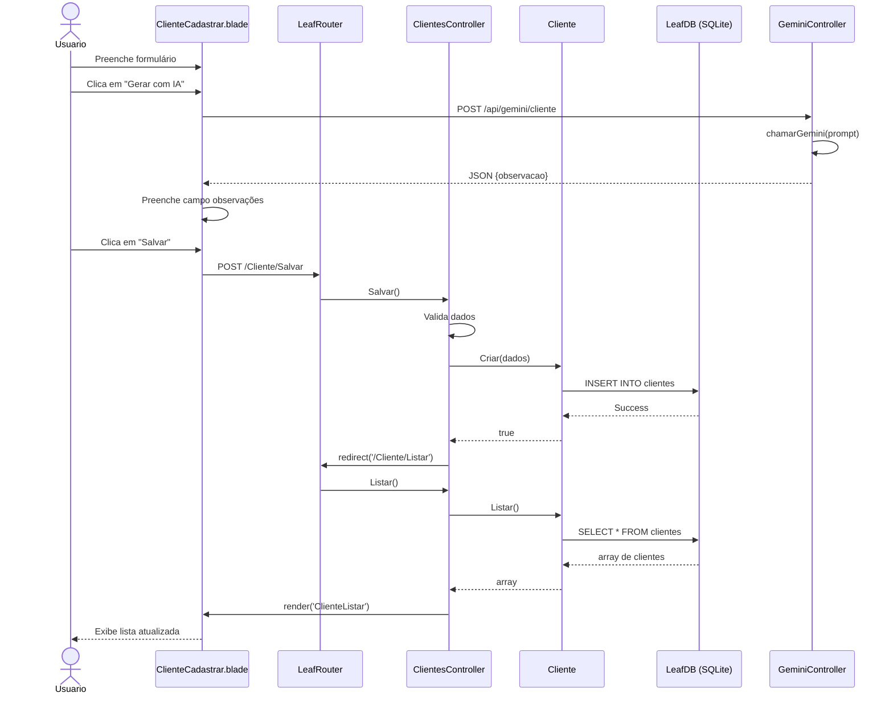
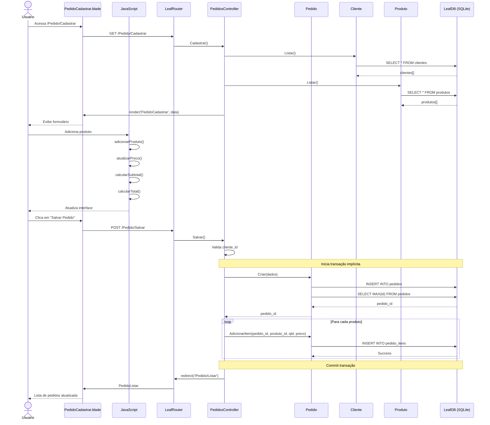
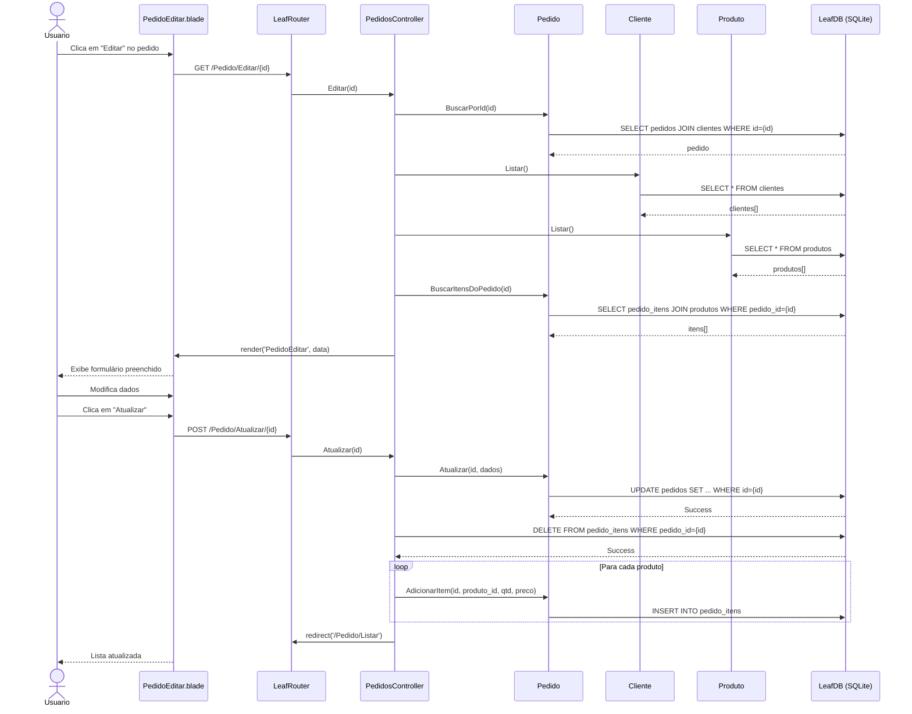
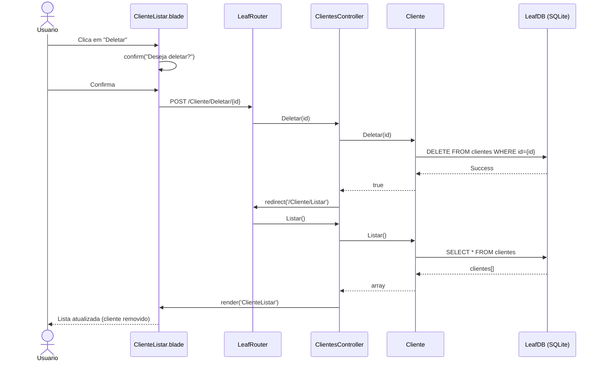
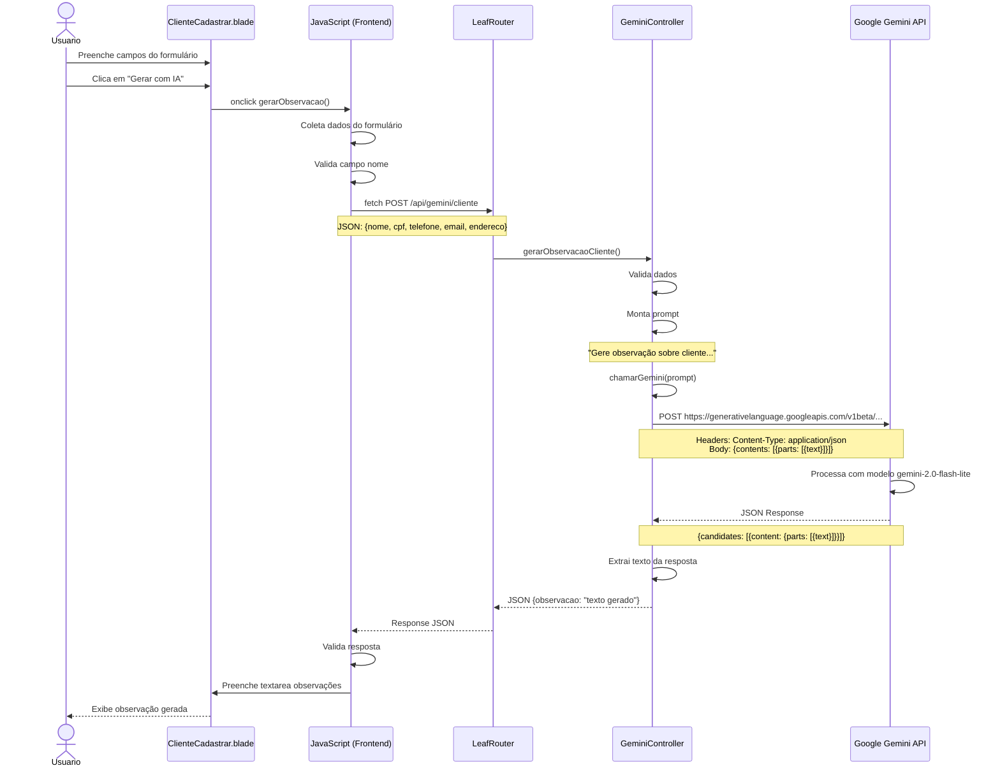
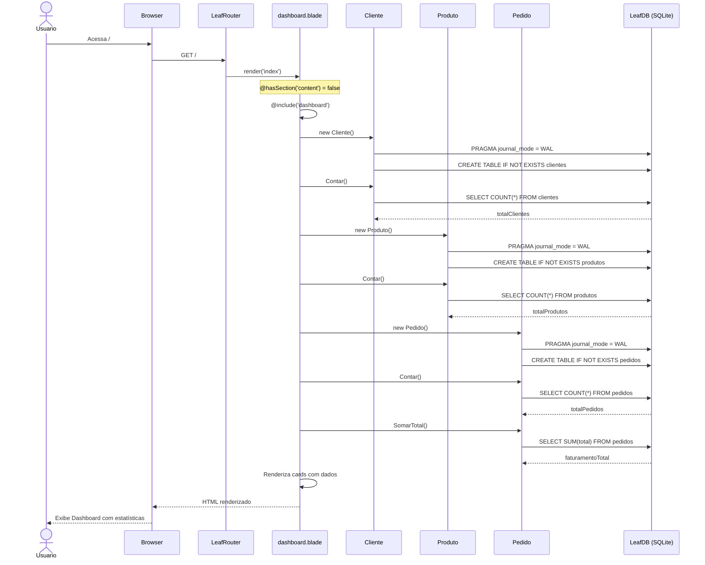

# Diagramas de Sequência - Proteus ERP

## 1. Criar Cliente

## 2. Criar Pedido com Itens

## 3. Editar Pedido

## 4. Deletar Cliente

## 5. Gerar Observação com IA (Gemini)

## 6. Dashboard (Carregamento Inicial)

## Notas sobre SQLite

- **WAL Mode**: Ativado em todos os models para permitir leituras simultâneas
- **Busy Timeout**: 5000ms para aguardar lock liberação
- **Transações**: Gerenciadas automaticamente pelo LeafDB
- **Connection Pooling**: Cada Model cria sua própria conexão

## Padrões Identificados

1. **MVC Pattern**: Separação clara entre Models, Views e Controllers
2. **RESTful Routes**: Uso de convenções REST (GET, POST)
3. **Repository Pattern**: Models atuam como repositórios de dados
4. **Blade Templating**: Engine de templates para views
5. **AJAX**: Comunicação assíncrona para API Gemini
6. **Query Builder**: LeafDB abstrai SQL nativo

