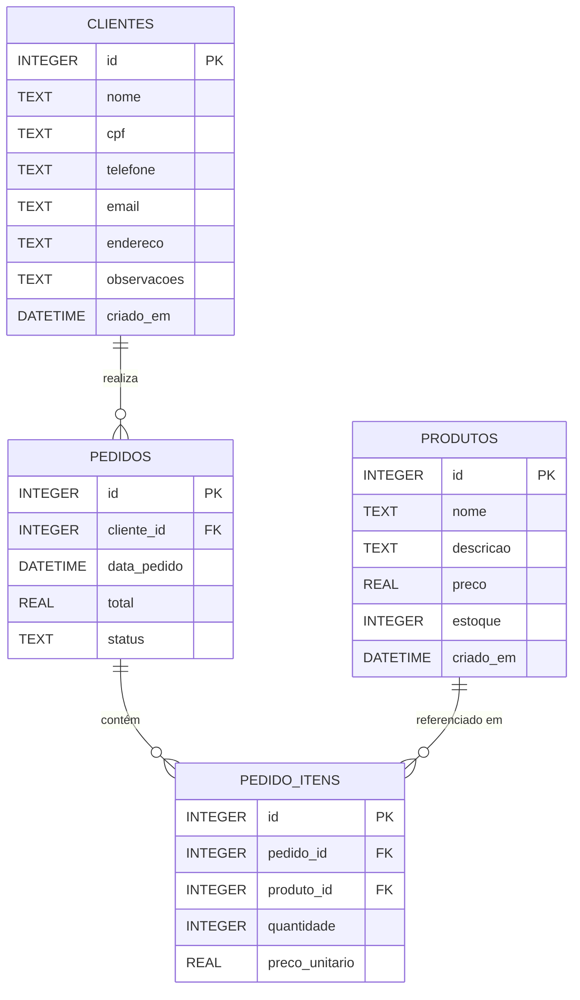

# 🗄️ Estrutura do Banco de Dados - Proteus ERP

## 📋 Índice

1. [Visão Geral](#1-visão-geral)
2. [Diagrama ER (Entidade-Relacionamento)](#2-diagrama-er-entidade-relacionamento)
3. [Tabelas Detalhadas](#3-tabelas-detalhadas)
4. [Relacionamentos](#4-relacionamentos)
5. [Scripts SQL](#5-scripts-sql)
6. [Índices e Otimizações](#6-índices-e-otimizações)
7. [Dados de Exemplo](#7-dados-de-exemplo)
8. [Queries Comuns](#8-queries-comuns)
9. [Migrações e Versionamento](#9-migrações-e-versionamento)
10. [Backup e Restore](#10-backup-e-restore)

---

## 1. Visão Geral

### 1.1 Informações Gerais

| Propriedade | Valor |
|-------------|-------|
| **SGBD** | SQLite 3.x |
| **Arquivo** | `osfacil.db` |
| **Encoding** | UTF-8 |
| **Journal Mode** | WAL (Write-Ahead Logging) |
| **Busy Timeout** | 5000ms |
| **Total de Tabelas** | 4 |

### 1.2 Tabelas do Sistema

| Tabela | Registros Típicos | Descrição |
|--------|-------------------|-----------|
| `clientes` | 100-10.000 | Cadastro de clientes |
| `produtos` | 50-5.000 | Catálogo de produtos |
| `pedidos` | 200-50.000 | Pedidos realizados |
| `pedido_itens` | 500-200.000 | Itens dos pedidos (N:N) |

### 1.3 Estatísticas do Banco

```sql
-- Tamanho típico do banco
10 MB - 100 MB (uso normal)
500 MB - 2 GB (uso intenso)

-- Limite teórico do SQLite
281 TB (mais que suficiente)
```

---

## 2. Diagrama ER (Entidade-Relacionamento)

### 2.1 Diagrama Completo



### 2.2 Cardinalidade

- **Cliente → Pedido**: 1:N (Um cliente pode ter vários pedidos)
- **Pedido → PedidoItem**: 1:N (Um pedido contém vários itens)
- **Produto → PedidoItem**: 1:N (Um produto pode estar em vários pedidos)
- **Pedido ↔ Produto**: N:N (Através de `pedido_itens`)

---

## 3. Tabelas Detalhadas

### 3.1 Tabela: `clientes`

#### Descrição
Armazena informações dos clientes que realizam pedidos no sistema.

#### Estrutura

| Coluna | Tipo | Null | Default | PK | FK | Descrição |
|--------|------|------|---------|----|----|-----------|
| `id` | INTEGER | NO | AUTOINCREMENT | ✅ | | Identificador único |
| `nome` | TEXT | NO | | | | Nome completo do cliente |
| `cpf` | TEXT | NO | | | | CPF do cliente |
| `telefone` | TEXT | YES | NULL | | | Telefone de contato |
| `email` | TEXT | YES | NULL | | | E-mail do cliente |
| `endereco` | TEXT | YES | NULL | | | Endereço completo |
| `observacoes` | TEXT | YES | NULL | | | Notas adicionais |
| `criado_em` | DATETIME | NO | CURRENT_TIMESTAMP | | | Data/hora de criação |

#### Constraints

```sql
PRIMARY KEY (id)
NOT NULL (nome, cpf)
```

#### Índices Recomendados

```sql
CREATE INDEX idx_clientes_cpf ON clientes(cpf);
CREATE INDEX idx_clientes_nome ON clientes(nome);
```

#### SQL de Criação

```sql
CREATE TABLE IF NOT EXISTS clientes (
    id INTEGER PRIMARY KEY AUTOINCREMENT,
    nome TEXT NOT NULL,
    cpf TEXT NOT NULL,
    telefone TEXT,
    email TEXT,
    endereco TEXT,
    observacoes TEXT,
    criado_em DATETIME DEFAULT CURRENT_TIMESTAMP
);
```

#### Exemplo de Registro

```sql
INSERT INTO clientes (nome, cpf, telefone, email, endereco, observacoes) VALUES
('João da Silva', '123.456.789-00', '(11) 98765-4321', 'joao@email.com', 
 'Rua Exemplo, 123 - São Paulo/SP', 
 'Cliente frequente, prefere contato por WhatsApp');
```

---

### 3.2 Tabela: `produtos`

#### Descrição
Catálogo de produtos disponíveis para venda.

#### Estrutura

| Coluna | Tipo | Null | Default | PK | FK | Descrição |
|--------|------|------|---------|----|----|-----------|
| `id` | INTEGER | NO | AUTOINCREMENT | ✅ | | Identificador único |
| `nome` | TEXT | NO | | | | Nome do produto |
| `descricao` | TEXT | YES | NULL | | | Descrição detalhada |
| `preco` | REAL | NO | 0 | | | Preço unitário |
| `estoque` | INTEGER | NO | 0 | | | Quantidade em estoque |
| `criado_em` | DATETIME | NO | CURRENT_TIMESTAMP | | | Data/hora de criação |

#### Constraints

```sql
PRIMARY KEY (id)
NOT NULL (nome, preco)
CHECK (preco >= 0)
CHECK (estoque >= 0)
```

#### Índices Recomendados

```sql
CREATE INDEX idx_produtos_nome ON produtos(nome);
CREATE INDEX idx_produtos_preco ON produtos(preco);
```

#### SQL de Criação

```sql
CREATE TABLE IF NOT EXISTS produtos (
    id INTEGER PRIMARY KEY AUTOINCREMENT,
    nome TEXT NOT NULL,
    descricao TEXT,
    preco REAL NOT NULL DEFAULT 0,
    estoque INTEGER DEFAULT 0,
    criado_em DATETIME DEFAULT CURRENT_TIMESTAMP
);
```

#### Exemplo de Registro

```sql
INSERT INTO produtos (nome, descricao, preco, estoque) VALUES
('Notebook Dell Inspiron 15', 
 'Notebook com processador Intel i5, 8GB RAM, SSD 256GB, tela 15.6"',
 3499.90,
 15);
```

---

### 3.3 Tabela: `pedidos`

#### Descrição
Registros dos pedidos realizados pelos clientes.

#### Estrutura

| Coluna | Tipo | Null | Default | PK | FK | Descrição |
|--------|------|------|---------|----|----|-----------|
| `id` | INTEGER | NO | AUTOINCREMENT | ✅ | | Identificador único |
| `cliente_id` | INTEGER | NO | | | ✅ | FK para `clientes(id)` |
| `data_pedido` | DATETIME | NO | CURRENT_TIMESTAMP | | | Data/hora do pedido |
| `total` | REAL | NO | 0 | | | Valor total do pedido |
| `status` | TEXT | NO | 'Pendente' | | | Status do pedido |

#### Constraints

```sql
PRIMARY KEY (id)
FOREIGN KEY (cliente_id) REFERENCES clientes(id)
NOT NULL (cliente_id, total)
CHECK (total >= 0)
```

#### Valores Possíveis para `status`

- `Pendente`: Aguardando processamento
- `Em Processamento`: Sendo preparado
- `Concluído`: Finalizado com sucesso
- `Cancelado`: Pedido cancelado

#### Índices Recomendados

```sql
CREATE INDEX idx_pedidos_cliente ON pedidos(cliente_id);
CREATE INDEX idx_pedidos_data ON pedidos(data_pedido);
CREATE INDEX idx_pedidos_status ON pedidos(status);
```

#### SQL de Criação

```sql
CREATE TABLE IF NOT EXISTS pedidos (
    id INTEGER PRIMARY KEY AUTOINCREMENT,
    cliente_id INTEGER NOT NULL,
    data_pedido DATETIME DEFAULT CURRENT_TIMESTAMP,
    total REAL DEFAULT 0,
    status TEXT DEFAULT 'Pendente'
);
```

#### Exemplo de Registro

```sql
INSERT INTO pedidos (cliente_id, total, status) VALUES
(1, 3499.90, 'Pendente');
```

---

### 3.4 Tabela: `pedido_itens`

#### Descrição
Tabela de relacionamento N:N entre pedidos e produtos. Armazena os itens individuais de cada pedido.

#### Estrutura

| Coluna | Tipo | Null | Default | PK | FK | Descrição |
|--------|------|------|---------|----|----|-----------|
| `id` | INTEGER | NO | AUTOINCREMENT | ✅ | | Identificador único |
| `pedido_id` | INTEGER | NO | | | ✅ | FK para `pedidos(id)` |
| `produto_id` | INTEGER | NO | | | ✅ | FK para `produtos(id)` |
| `quantidade` | INTEGER | NO | | | | Quantidade comprada |
| `preco_unitario` | REAL | NO | | | | Preço no momento da compra |

#### Constraints

```sql
PRIMARY KEY (id)
FOREIGN KEY (pedido_id) REFERENCES pedidos(id) ON DELETE CASCADE
FOREIGN KEY (produto_id) REFERENCES produtos(id)
NOT NULL (pedido_id, produto_id, quantidade, preco_unitario)
CHECK (quantidade > 0)
CHECK (preco_unitario >= 0)
```

#### Observação Importante

O campo `preco_unitario` armazena o preço do produto **no momento da compra**, garantindo histórico correto mesmo que o preço do produto seja alterado posteriormente no catálogo.

#### Índices Recomendados

```sql
CREATE INDEX idx_pedido_itens_pedido ON pedido_itens(pedido_id);
CREATE INDEX idx_pedido_itens_produto ON pedido_itens(produto_id);
```

#### SQL de Criação

```sql
CREATE TABLE IF NOT EXISTS pedido_itens (
    id INTEGER PRIMARY KEY AUTOINCREMENT,
    pedido_id INTEGER NOT NULL,
    produto_id INTEGER NOT NULL,
    quantidade INTEGER NOT NULL,
    preco_unitario REAL NOT NULL
);
```

#### Exemplo de Registro

```sql
INSERT INTO pedido_itens (pedido_id, produto_id, quantidade, preco_unitario) VALUES
(1, 1, 2, 3499.90);  -- 2 notebooks no pedido #1
```

---

## 4. Relacionamentos

### 4.1 Cliente → Pedido (1:N)

**Tipo**: Um-para-Muitos  
**Descrição**: Um cliente pode realizar múltiplos pedidos.

```sql
-- Buscar todos os pedidos de um cliente
SELECT p.* 
FROM pedidos p
WHERE p.cliente_id = 1;

-- Buscar pedidos com nome do cliente
SELECT p.*, c.nome as cliente_nome
FROM pedidos p
INNER JOIN clientes c ON p.cliente_id = c.id;
```

**Regra de Negócio**: 
- Um pedido deve sempre ter um cliente associado
- Cliente não pode ser deletado se tiver pedidos (implementação futura)

---

### 4.2 Pedido → PedidoItem (1:N)

**Tipo**: Um-para-Muitos  
**Descrição**: Um pedido contém múltiplos itens.

```sql
-- Buscar itens de um pedido
SELECT pi.*, pr.nome as produto_nome
FROM pedido_itens pi
INNER JOIN produtos pr ON pi.produto_id = pr.id
WHERE pi.pedido_id = 1;

-- Calcular subtotal de cada item
SELECT 
    pi.id,
    pr.nome,
    pi.quantidade,
    pi.preco_unitario,
    (pi.quantidade * pi.preco_unitario) as subtotal
FROM pedido_itens pi
INNER JOIN produtos pr ON pi.produto_id = pr.id
WHERE pi.pedido_id = 1;
```

**Regra de Negócio**:
- Ao deletar pedido, todos os itens são deletados em cascata
- Total do pedido deve ser recalculado ao adicionar/remover itens

---

### 4.3 Produto → PedidoItem (1:N)

**Tipo**: Um-para-Muitos  
**Descrição**: Um produto pode aparecer em múltiplos pedidos.

```sql
-- Buscar todos os pedidos que contêm um produto específico
SELECT 
    p.id as pedido_id,
    c.nome as cliente,
    p.data_pedido,
    pi.quantidade,
    pi.preco_unitario
FROM pedido_itens pi
INNER JOIN pedidos p ON pi.pedido_id = p.id
INNER JOIN clientes c ON p.cliente_id = c.id
WHERE pi.produto_id = 1;
```

**Regra de Negócio**:
- Produto não pode ser deletado se estiver em pedidos (implementação futura)
- Preço do produto no pedido é congelado no momento da compra

---

### 4.4 Pedido ↔ Produto (N:N)

**Tipo**: Muitos-para-Muitos (através de `pedido_itens`)  
**Descrição**: Um pedido pode ter vários produtos, e um produto pode estar em vários pedidos.

```sql
-- Listar produtos de um pedido
SELECT 
    pr.id,
    pr.nome,
    pi.quantidade,
    pi.preco_unitario,
    (pi.quantidade * pi.preco_unitario) as subtotal
FROM produtos pr
INNER JOIN pedido_itens pi ON pr.id = pi.produto_id
WHERE pi.pedido_id = 1;

-- Listar pedidos que contêm um produto
SELECT DISTINCT
    p.id,
    c.nome as cliente,
    p.data_pedido,
    p.total,
    p.status
FROM pedidos p
INNER JOIN pedido_itens pi ON p.id = pi.pedido_id
INNER JOIN clientes c ON p.cliente_id = c.id
WHERE pi.produto_id = 1;
```

---

## 5. Scripts SQL

### 5.1 Criação Completa do Banco

```sql
-- =============================================
-- Script de Criação Completo - Proteus ERP
-- Versão: 1.0
-- Data: Novembro 2024
-- =============================================

-- Configurações do SQLite
PRAGMA foreign_keys = OFF;  -- Desabilitar temporariamente
PRAGMA journal_mode = WAL;
PRAGMA busy_timeout = 5000;

-- =============================================
-- Tabela: clientes
-- =============================================
CREATE TABLE IF NOT EXISTS clientes (
    id INTEGER PRIMARY KEY AUTOINCREMENT,
    nome TEXT NOT NULL,
    cpf TEXT NOT NULL,
    telefone TEXT,
    email TEXT,
    endereco TEXT,
    observacoes TEXT,
    criado_em DATETIME DEFAULT CURRENT_TIMESTAMP
);

-- =============================================
-- Tabela: produtos
-- =============================================
CREATE TABLE IF NOT EXISTS produtos (
    id INTEGER PRIMARY KEY AUTOINCREMENT,
    nome TEXT NOT NULL,
    descricao TEXT,
    preco REAL NOT NULL DEFAULT 0,
    estoque INTEGER DEFAULT 0,
    criado_em DATETIME DEFAULT CURRENT_TIMESTAMP
);

-- =============================================
-- Tabela: pedidos
-- =============================================
CREATE TABLE IF NOT EXISTS pedidos (
    id INTEGER PRIMARY KEY AUTOINCREMENT,
    cliente_id INTEGER NOT NULL,
    data_pedido DATETIME DEFAULT CURRENT_TIMESTAMP,
    total REAL DEFAULT 0,
    status TEXT DEFAULT 'Pendente'
);

-- =============================================
-- Tabela: pedido_itens
-- =============================================
CREATE TABLE IF NOT EXISTS pedido_itens (
    id INTEGER PRIMARY KEY AUTOINCREMENT,
    pedido_id INTEGER NOT NULL,
    produto_id INTEGER NOT NULL,
    quantidade INTEGER NOT NULL,
    preco_unitario REAL NOT NULL
);

-- =============================================
-- Índices para Performance
-- =============================================

-- Clientes
CREATE INDEX IF NOT EXISTS idx_clientes_cpf ON clientes(cpf);
CREATE INDEX IF NOT EXISTS idx_clientes_nome ON clientes(nome);

-- Produtos
CREATE INDEX IF NOT EXISTS idx_produtos_nome ON produtos(nome);
CREATE INDEX IF NOT EXISTS idx_produtos_preco ON produtos(preco);

-- Pedidos
CREATE INDEX IF NOT EXISTS idx_pedidos_cliente ON pedidos(cliente_id);
CREATE INDEX IF NOT EXISTS idx_pedidos_data ON pedidos(data_pedido);
CREATE INDEX IF NOT EXISTS idx_pedidos_status ON pedidos(status);

-- Pedido Itens
CREATE INDEX IF NOT EXISTS idx_pedido_itens_pedido ON pedido_itens(pedido_id);
CREATE INDEX IF NOT EXISTS idx_pedido_itens_produto ON pedido_itens(produto_id);

-- =============================================
-- Reabilitar Foreign Keys
-- =============================================
PRAGMA foreign_keys = ON;

-- =============================================
-- Verificação
-- =============================================
SELECT 'Banco de dados criado com sucesso!' AS resultado;
```

### 5.2 Script de Reset (Desenvolvimento)

```sql
-- =============================================
-- CUIDADO: Este script apaga TODOS os dados!
-- Use apenas em ambiente de desenvolvimento
-- =============================================

DROP TABLE IF EXISTS pedido_itens;
DROP TABLE IF EXISTS pedidos;
DROP TABLE IF EXISTS produtos;
DROP TABLE IF EXISTS clientes;

-- Recriar estrutura
-- (executar script de criação após este)
```

### 5.3 Script de Limpeza de Dados

```sql
-- Limpar dados mantendo estrutura
DELETE FROM pedido_itens;
DELETE FROM pedidos;
DELETE FROM produtos;
DELETE FROM clientes;

-- Resetar autoincrement
DELETE FROM sqlite_sequence WHERE name='clientes';
DELETE FROM sqlite_sequence WHERE name='produtos';
DELETE FROM sqlite_sequence WHERE name='pedidos';
DELETE FROM sqlite_sequence WHERE name='pedido_itens';

-- Vacuum para otimizar
VACUUM;
```

---

## 6. Índices e Otimizações

### 6.1 Índices Implementados

```sql
-- Índices de busca frequente
CREATE INDEX idx_clientes_cpf ON clientes(cpf);
CREATE INDEX idx_clientes_nome ON clientes(nome);
CREATE INDEX idx_produtos_nome ON produtos(nome);
CREATE INDEX idx_produtos_preco ON produtos(preco);

-- Índices de relacionamento (Foreign Keys)
CREATE INDEX idx_pedidos_cliente ON pedidos(cliente_id);
CREATE INDEX idx_pedido_itens_pedido ON pedido_itens(pedido_id);
CREATE INDEX idx_pedido_itens_produto ON pedido_itens(produto_id);

-- Índices de filtro
CREATE INDEX idx_pedidos_data ON pedidos(data_pedido);
CREATE INDEX idx_pedidos_status ON pedidos(status);
```

### 6.2 Análise de Performance

```sql
-- Ver plano de execução de uma query
EXPLAIN QUERY PLAN
SELECT p.*, c.nome 
FROM pedidos p
INNER JOIN clientes c ON p.cliente_id = c.id
WHERE p.status = 'Pendente';

-- Ver estatísticas de tabelas
SELECT name, rootpage, sql 
FROM sqlite_master 
WHERE type='table';

-- Ver índices de uma tabela
SELECT * FROM sqlite_master 
WHERE type='index' AND tbl_name='pedidos';
```

### 6.3 Configurações de Otimização

```sql
-- WAL Mode (melhor concorrência)
PRAGMA journal_mode = WAL;

-- Aumentar timeout para locks
PRAGMA busy_timeout = 5000;

-- Cache size (em páginas, default = -2000 = 2MB)
PRAGMA cache_size = -10000;  -- 10MB

-- Análise automática de queries
PRAGMA optimize;

-- Analisar estatísticas das tabelas
ANALYZE;
```

### 6.4 Manutenção Periódica

```sql
-- Vacuum (compactar e otimizar)
VACUUM;

-- Reindexar todas as tabelas
REINDEX;

-- Analisar estatísticas
ANALYZE;

-- Verificar integridade
PRAGMA integrity_check;
```

---

## 7. Dados de Exemplo

### 7.1 Dataset Completo de Teste

```sql
-- =============================================
-- Inserir Clientes
-- =============================================
INSERT INTO clientes (nome, cpf, telefone, email, endereco, observacoes) VALUES
('João Silva', '123.456.789-00', '(11) 98765-4321', 'joao@email.com', 
 'Rua das Flores, 123 - São Paulo/SP', 
 'Cliente frequente, prefere entrega rápida'),
 
('Maria Santos', '987.654.321-00', '(21) 97654-3210', 'maria@email.com',
 'Av. Principal, 456 - Rio de Janeiro/RJ',
 'Empresa de tecnologia, solicitar nota fiscal'),
 
('Carlos Oliveira', '456.789.123-00', '(11) 96543-2109', 'carlos@email.com',
 'Rua Exemplo, 789 - São Paulo/SP',
 'Pagamento sempre à vista');

-- =============================================
-- Inserir Produtos
-- =============================================
INSERT INTO produtos (nome, descricao, preco, estoque) VALUES
('Notebook Dell Inspiron 15', 
 'Intel Core i5-1135G7, 8GB RAM, SSD 256GB, Tela 15.6" Full HD',
 3499.90, 15),
 
('Mouse Logitech MX Master 3',
 'Mouse wireless ergonômico, 7 botões programáveis, bateria recarregável',
 549.90, 50),
 
('Teclado Mecânico Keychron K2',
 'Teclado mecânico 75%, switches Gateron Brown, RGB, wireless',
 599.90, 30),
 
('Monitor LG UltraWide 29"',
 'Monitor 29" IPS, resolução 2560x1080, 75Hz, HDMI/DisplayPort',
 1299.90, 20),
 
('Webcam Logitech C920',
 'Full HD 1080p, foco automático, microfone estéreo embutido',
 499.90, 40);

-- =============================================
-- Inserir Pedidos
-- =============================================

-- Pedido 1: João compra notebook e mouse
INSERT INTO pedidos (cliente_id, total, status) VALUES
(1, 4049.80, 'Concluído');

INSERT INTO pedido_itens (pedido_id, produto_id, quantidade, preco_unitario) VALUES
(1, 1, 1, 3499.90),  -- 1 Notebook
(1, 2, 1, 549.90);   -- 1 Mouse

-- Pedido 2: Maria compra kit completo
INSERT INTO pedidos (cliente_id, total, status) VALUES
(2, 5949.60, 'Em Processamento');

INSERT INTO pedido_itens (pedido_id, produto_id, quantidade, preco_unitario) VALUES
(2, 1, 1, 3499.90),  -- 1 Notebook
(2, 2, 1, 549.90),   -- 1 Mouse
(2, 3, 1, 599.90),   -- 1 Teclado
(2, 4, 1, 1299.90);  -- 1 Monitor

-- Pedido 3: Carlos compra webcam
INSERT INTO pedidos (cliente_id, total, status) VALUES
(3, 499.90, 'Pendente');

INSERT INTO pedido_itens (pedido_id, produto_id, quantidade, preco_unitario) VALUES
(3, 5, 1, 499.90);   -- 1 Webcam

-- Pedido 4: João compra mais 2 mouses
INSERT INTO pedidos (cliente_id, total, status) VALUES
(1, 1099.80, 'Concluído');

INSERT INTO pedido_itens (pedido_id, produto_id, quantidade, preco_unitario) VALUES
(4, 2, 2, 549.90);   -- 2 Mouses
```

### 7.2 Verificar Dados Inseridos

```sql
-- Total de registros
SELECT 'Clientes' as tabela, COUNT(*) as total FROM clientes
UNION ALL
SELECT 'Produtos', COUNT(*) FROM produtos
UNION ALL
SELECT 'Pedidos', COUNT(*) FROM pedidos
UNION ALL
SELECT 'Itens', COUNT(*) FROM pedido_itens;

-- Resultado esperado:
-- Clientes: 3
-- Produtos: 5
-- Pedidos: 4
-- Itens: 8
```

---

## 8. Queries Comuns

### 8.1 Consultas de Clientes

```sql
-- Listar todos os clientes
SELECT * FROM clientes ORDER BY nome;

-- Buscar cliente por CPF
SELECT * FROM clientes WHERE cpf = '123.456.789-00';

-- Buscar clientes por nome (parcial)
SELECT * FROM clientes WHERE nome LIKE '%Silva%';

-- Contar total de clientes
SELECT COUNT(*) as total FROM clientes;

-- Clientes cadastrados nos últimos 30 dias
SELECT * FROM clientes 
WHERE criado_em >= datetime('now', '-30 days')
ORDER BY criado_em DESC;
```

### 8.2 Consultas de Produtos

```sql
-- Listar produtos ordenados por preço
SELECT * FROM produtos ORDER BY preco DESC;

-- Produtos com estoque baixo (< 10 unidades)
SELECT * FROM produtos WHERE estoque < 10;

-- Produtos mais caros
SELECT * FROM produtos ORDER BY preco DESC LIMIT 5;

-- Produtos sem estoque
SELECT * FROM produtos WHERE estoque = 0;

-- Valor total do estoque
SELECT SUM(preco * estoque) as valor_total_estoque FROM produtos;
```

### 8.3 Consultas de Pedidos

```sql
-- Listar pedidos com nome do cliente
SELECT 
    p.id,
    c.nome as cliente,
    p.data_pedido,
    p.total,
    p.status
FROM pedidos p
INNER JOIN clientes c ON p.cliente_id = c.id
ORDER BY p.data_pedido DESC;

-- Pedidos de um cliente específico
SELECT * FROM pedidos 
WHERE cliente_id = 1
ORDER BY data_pedido DESC;

-- Pedidos por status
SELECT status, COUNT(*) as quantidade, SUM(total) as valor_total
FROM pedidos
GROUP BY status;

-- Pedidos do mês atual
SELECT p.*, c.nome as cliente
FROM pedidos p
INNER JOIN clientes c ON p.cliente_id = c.id
WHERE strftime('%Y-%m', p.data_pedido) = strftime('%Y-%m', 'now');

-- Faturamento total
SELECT SUM(total) as faturamento_total FROM pedidos;

-- Faturamento por mês
SELECT 
    strftime('%Y-%m', data_pedido) as mes,
    COUNT(*) as num_pedidos,
    SUM(total) as faturamento
FROM pedidos
GROUP BY strftime('%Y-%m', data_pedido)
ORDER BY mes DESC;
```

### 8.4 Consultas de Itens de Pedido

```sql
-- Detalhes completos de um pedido
SELECT 
    pi.id,
    pr.nome as produto,
    pi.quantidade,
    pi.preco_unitario,
    (pi.quantidade * pi.preco_unitario) as subtotal
FROM pedido_itens pi
INNER JOIN produtos pr ON pi.produto_id = pr.id
WHERE pi.pedido_id = 1;

-- Produtos mais vendidos
SELECT 
    pr.id,
    pr.nome,
    SUM(pi.quantidade) as total_vendido,
    SUM(pi.quantidade * pi.preco_unitario) as receita_total
FROM pedido_itens pi
INNER JOIN produtos pr ON pi.produto_id = pr.id
GROUP BY pr.id, pr.nome
ORDER BY total_vendido DESC;

-- Histórico de preços de um produto
SELECT 
    p.data_pedido,
    pi.preco_unitario,
    pi.quantidade,
    c.nome as cliente
FROM pedido_itens pi
INNER JOIN pedidos p ON pi.pedido_id = p.id
INNER JOIN clientes c ON p.cliente_id = c.id
WHERE pi.produto_id = 1
ORDER BY p.data_pedido DESC;
```

### 8.5 Relatórios Complexos

```sql
-- Dashboard completo
SELECT 
    (SELECT COUNT(*) FROM clientes) as total_clientes,
    (SELECT COUNT(*) FROM produtos) as total_produtos,
    (SELECT COUNT(*) FROM pedidos) as total_pedidos,
    (SELECT SUM(total) FROM pedidos) as faturamento_total,
    (SELECT COUNT(*) FROM pedidos WHERE status = 'Pendente') as pedidos_pendentes;

-- Top 5 clientes por valor de compras
SELECT 
    c.id,
    c.nome,
    COUNT(p.id) as num_pedidos,
    SUM(p.total) as total_gasto
FROM clientes c
INNER JOIN pedidos p ON c.id = p.cliente_id
GROUP BY c.id, c.nome
ORDER BY total_gasto DESC
LIMIT 5;

-- Produtos que nunca foram vendidos
SELECT pr.*
FROM produtos pr
LEFT JOIN pedido_itens pi ON pr.id = pi.produto_id
WHERE pi.id IS NULL;

-- Análise de vendas por dia da semana
SELECT 
    CASE CAST(strftime('%w', data_pedido) AS INTEGER)
        WHEN 0 THEN 'Domingo'
        WHEN 1 THEN 'Segunda'
        WHEN 2 THEN 'Terça'
        WHEN 3 THEN 'Quarta'
        WHEN 4 THEN 'Quinta'
        WHEN 5 THEN 'Sexta'
        WHEN 6 THEN 'Sábado'
    END as dia_semana,
    COUNT(*) as num_pedidos,
    AVG(total) as ticket_medio
FROM pedidos
GROUP BY strftime('%w', data_pedido)
ORDER BY CAST(strftime('%w', data_pedido) AS INTEGER);
```

### 8.6 Operações de Manutenção

```sql
-- Verificar integridade referencial
SELECT p.id, p.cliente_id
FROM pedidos p
LEFT JOIN clientes c ON p.cliente_id = c.id
WHERE c.id IS NULL;

-- Pedidos com total inconsistente
SELECT 
    p.id,
    p.total as total_registrado,
    COALESCE(SUM(pi.quantidade * pi.preco_unitario), 0) as total_calculado
FROM pedidos p
LEFT JOIN pedido_itens pi ON p.id = pi.pedido_id
GROUP BY p.id, p.total
HAVING ABS(p.total - COALESCE(SUM(pi.quantidade * pi.preco_unitario), 0)) > 0.01;

-- Atualizar estoque após venda (exemplo)
UPDATE produtos
SET estoque = estoque - 1
WHERE id = 1;
```

---

## 9. Migrações e Versionamento

### 9.1 Estratégia de Migração

Atualmente, o sistema cria tabelas automaticamente no construtor de cada Model. Para ambientes de produção, recomenda-se implementar sistema de migrations.

### 9.2 Estrutura de Migration

```sql
-- migrations/001_criar_tabelas_iniciais.sql
-- Data: 2024-11-01
-- Descrição: Criação inicial das tabelas

BEGIN TRANSACTION;

CREATE TABLE IF NOT EXISTS clientes (...);
CREATE TABLE IF NOT EXISTS produtos (...);
-- ... demais tabelas

-- Registrar migração
CREATE TABLE IF NOT EXISTS migrations (
    id INTEGER PRIMARY KEY AUTOINCREMENT,
    version TEXT NOT NULL,
    description TEXT,
    executed_at DATETIME DEFAULT CURRENT_TIMESTAMP
);

INSERT INTO migrations (version, description) VALUES
('001', 'Criação inicial das tabelas');

COMMIT;
```

### 9.3 Exemplo de Migration de Alteração

```sql
-- migrations/002_adicionar_campo_ativo_clientes.sql
-- Data: 2024-11-15
-- Descrição: Adicionar campo 'ativo' em clientes

BEGIN TRANSACTION;

ALTER TABLE clientes ADD COLUMN ativo INTEGER DEFAULT 1;

CREATE INDEX idx_clientes_ativo ON clientes(ativo);

INSERT INTO migrations (version, description) VALUES
('002', 'Adicionar campo ativo em clientes');

COMMIT;
```

### 9.4 Rollback de Migration

```sql
-- migrations/002_rollback.sql
-- Rollback da migration 002

BEGIN TRANSACTION;

-- SQLite não suporta DROP COLUMN diretamente
-- Necessário recriar tabela

-- Criar tabela temporária
CREATE TABLE clientes_temp AS SELECT 
    id, nome, cpf, telefone, email, endereco, observacoes, criado_em
FROM clientes;

DROP TABLE clientes;

CREATE TABLE clientes (
    id INTEGER PRIMARY KEY AUTOINCREMENT,
    nome TEXT NOT NULL,
    cpf TEXT NOT NULL,
    telefone TEXT,
    email TEXT,
    endereco TEXT,
    observacoes TEXT,
    criado_em DATETIME DEFAULT CURRENT_TIMESTAMP
);

INSERT INTO clientes SELECT * FROM clientes_temp;
DROP TABLE clientes_temp;

-- Remover registro de migração
DELETE FROM migrations WHERE version = '002';

COMMIT;
```

### 9.5 Versionamento do Schema

```sql
-- Ver versão atual do schema
SELECT MAX(version) as versao_atual FROM migrations;

-- Histórico de migrations
SELECT * FROM migrations ORDER BY executed_at DESC;
```

---

## 10. Backup e Restore

### 10.1 Backup Completo

#### Método 1: Cópia do Arquivo

```bash
# Backup simples (arquivo único)
cp osfacil.db backups/osfacil_$(date +%Y%m%d_%H%M%S).db

# Backup com compressão
tar -czf backups/osfacil_$(date +%Y%m%d).tar.gz osfacil.db

# Backup incluindo WAL e SHM
cp osfacil.db* backups/
```

#### Método 2: Dump SQL

```bash
# Exportar para SQL
sqlite3 osfacil.db .dump > backups/osfacil_dump.sql

# Exportar apenas schema
sqlite3 osfacil.db .schema > backups/osfacil_schema.sql

# Exportar apenas dados
sqlite3 osfacil.db "SELECT sql FROM sqlite_master WHERE type='table'" > /dev/null
sqlite3 osfacil.db .dump | grep -v '^CREATE' > backups/osfacil_data.sql
```

#### Método 3: Backup Automático (Cron)

```bash
# Adicionar ao crontab
crontab -e

# Backup diário às 2h da manhã
0 2 * * * /usr/bin/cp /path/to/osfacil.db /backups/osfacil_$(date +\%Y\%m\%d).db

# Backup semanal com compressão
0 3 * * 0 tar -czf /backups/weekly/osfacil_$(date +\%Y\%m\%d).tar.gz /path/to/osfacil.db
```

### 10.2 Restore

#### Restore de arquivo

```bash
# Restore simples
cp backups/osfacil_20241113.db osfacil.db

# Restore de backup compactado
tar -xzf backups/osfacil_20241113.tar.gz
```

#### Restore de SQL dump

```bash
# Recriar banco do zero
rm osfacil.db
sqlite3 osfacil.db < backups/osfacil_dump.sql

# Importar apenas dados
sqlite3 osfacil.db < backups/osfacil_data.sql
```

### 10.3 Backup Incremental

```sql
-- Backup apenas de registros novos (desde última data)

-- Exportar clientes novos
.mode csv
.output backups/clientes_incremental.csv
SELECT * FROM clientes WHERE criado_em >= '2024-11-01';
.output stdout

-- Importar backup incremental
.mode csv
.import backups/clientes_incremental.csv clientes
```

### 10.4 Rotação de Backups

```bash
#!/bin/bash
# Script de rotação de backups

BACKUP_DIR="/backups"
RETENTION_DAYS=30

# Criar backup
cp osfacil.db "$BACKUP_DIR/osfacil_$(date +%Y%m%d).db"

# Remover backups antigos (mais de 30 dias)
find "$BACKUP_DIR" -name "osfacil_*.db" -mtime +$RETENTION_DAYS -delete

# Manter apenas 10 backups mais recentes
ls -t "$BACKUP_DIR"/osfacil_*.db | tail -n +11 | xargs rm -f

echo "Backup concluído: $(date)"
```

### 10.5 Verificação de Integridade

```sql
-- Verificar integridade do banco
PRAGMA integrity_check;

-- Quick check (mais rápido)
PRAGMA quick_check;

-- Verificar foreign keys
PRAGMA foreign_key_check;

-- Resultado esperado: "ok"
```

### 10.6 Sincronização com Cloud

```bash
# Sync com AWS S3
aws s3 sync /path/to/backups/ s3://meu-bucket/proteus-backups/

# Sync com Google Drive (rclone)
rclone sync /path/to/backups/ gdrive:Proteus-Backups/

# Rsync para servidor remoto
rsync -avz /path/to/osfacil.db user@servidor:/backups/
```

---

## 📊 Estatísticas do Banco

### Tamanho Estimado por Tabela

| Tabela | Tamanho por Registro | 1.000 registros | 10.000 registros |
|--------|----------------------|-----------------|------------------|
| `clientes` | ~500 bytes | ~500 KB | ~5 MB |
| `produtos` | ~400 bytes | ~400 KB | ~4 MB |
| `pedidos` | ~200 bytes | ~200 KB | ~2 MB |
| `pedido_itens` | ~150 bytes | ~150 KB | ~1.5 MB |

### Limites do SQLite

- **Tamanho máximo do banco**: 281 TB
- **Tamanho máximo de linha**: 1 GB
- **Colunas por tabela**: 2.000
- **Tabelas por banco**: Ilimitado (praticamente)
- **Anexos (BLOB)**: 2 GB por campo

---

## 🔍 Troubleshooting

### Problema: Database is locked

```sql
-- Verificar conexões abertas
PRAGMA locking_mode;

-- Forçar checkpoint (WAL)
PRAGMA wal_checkpoint(FULL);

-- Aumentar timeout
PRAGMA busy_timeout = 10000;
```

### Problema: Banco corrompido

```bash
# Dump e recriar
sqlite3 osfacil.db .dump | sqlite3 osfacil_novo.db

# Verificar integridade
sqlite3 osfacil.db "PRAGMA integrity_check;"
```

### Problema: Performance lenta

```sql
-- Reindexar
REINDEX;

-- Analisar estatísticas
ANALYZE;

-- Vacuum (compactar)
VACUUM;

-- Verificar query plans
EXPLAIN QUERY PLAN SELECT ...;
```

---

## 📚 Referências

- **SQLite Documentation**: https://www.sqlite.org/docs.html
- **WAL Mode**: https://www.sqlite.org/wal.html
- **Query Planner**: https://www.sqlite.org/queryplanner.html
- **Optimization**: https://www.sqlite.org/optoverview.html

---

**Versão do Documento**: 1.0  
**Última Atualização**: Novembro 2024  
**Mantido por**: Equipe Proteus ERP

